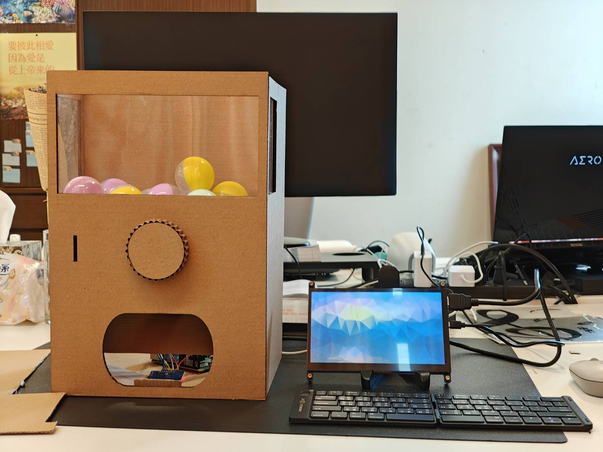
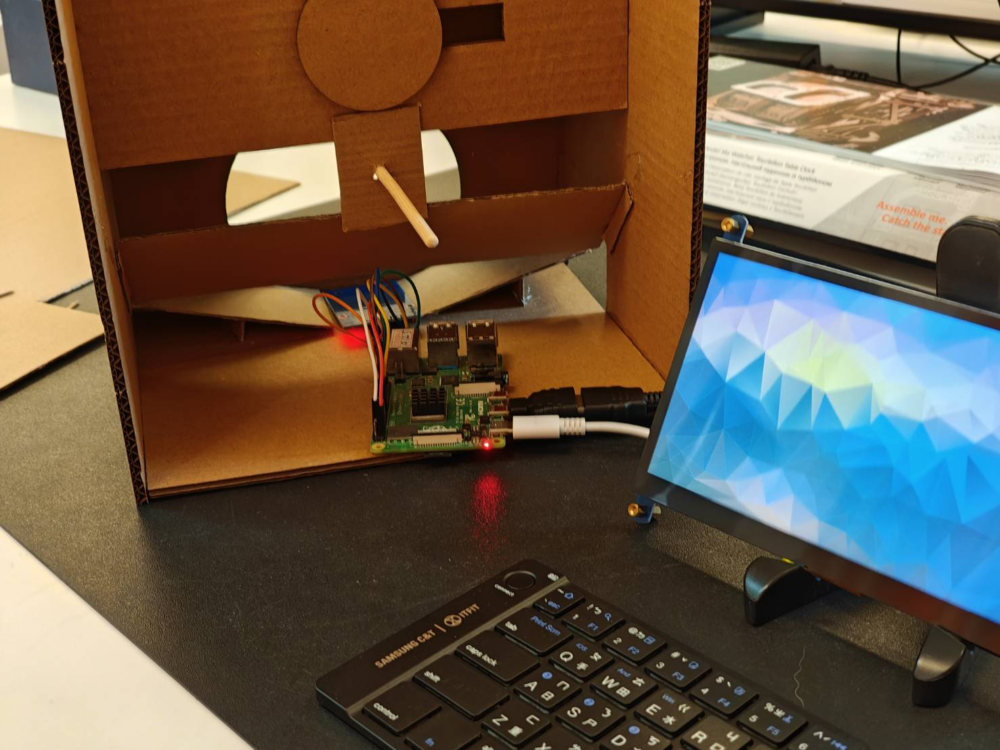
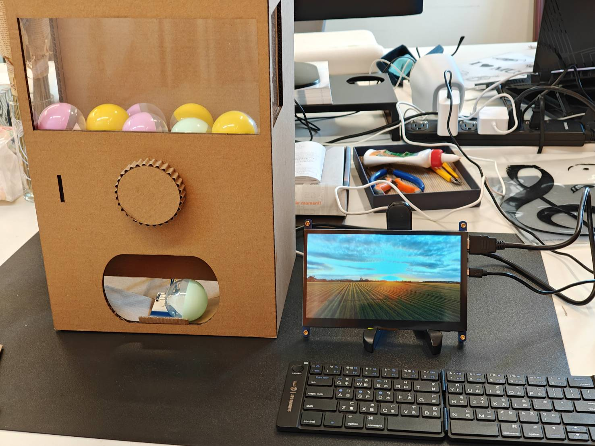
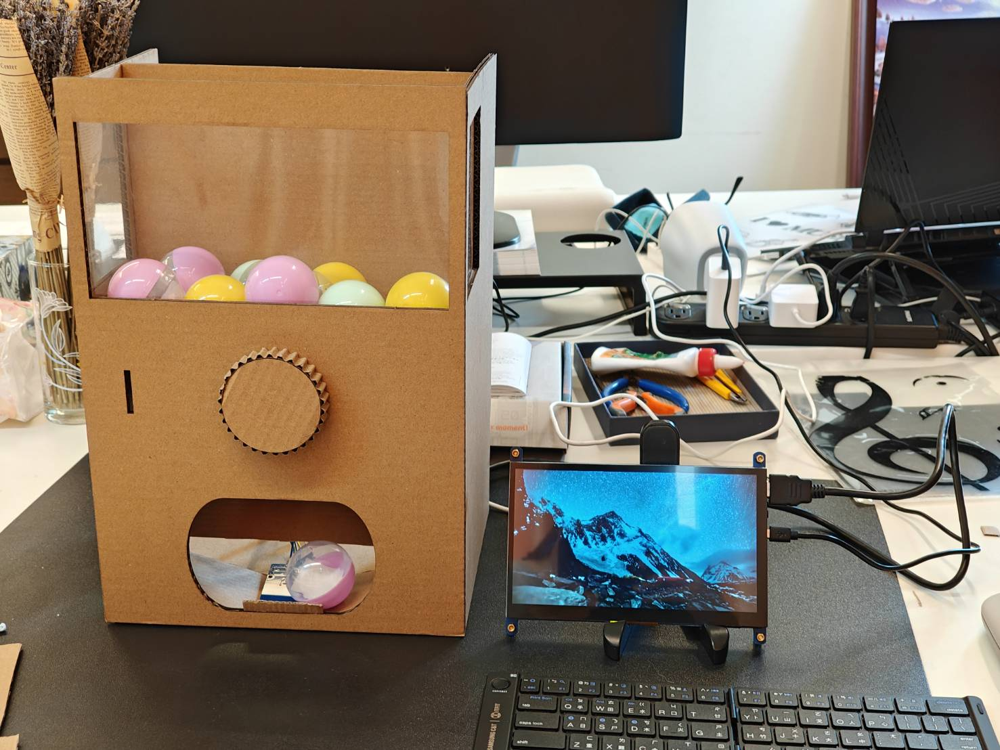
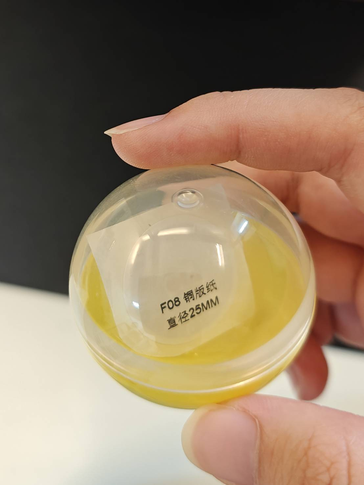

# Gacha
用樹莓派和 RC522 RFID 模組，做出能偵測扭蛋掉落並撥放動畫的扭蛋機。

# 成果展示





# 使用方式
## 準備數莓派、RC522 和扭蛋

將樹莓派和 RC522 RFID 模組連接如下圖  


將 NFC 貼紙放進扭蛋中
  

## 登入扭蛋 UID
1. 建立 `uid_a.txt` 和 `uid_b.txt` 兩個空白文件

2. 執行 `record_uid.py` ，選擇要登入的類別然後將 NFC 貼紙靠近 RC522 模組

```bash
winsh@raspberrypi:~/Desktop/Gacha $ python3 record_uid.py 
請選擇要記錄的類別：
輸入 A 或 B：A
開始記錄 UID 到 uid_a.txt
請將卡片一張一張靠近讀卡機，Ctrl+C 結束

偵測到 UID：532587712607
→ 已寫入 uid_a.txt
偵測到 UID：603186172126
→ 已寫入 uid_a.txt
```

## 開始遊戲
執行 `main.py` 即可開始，將裝有 NFC 貼紙的扭蛋靠近 RC522 模組，螢幕就會撥放對應的影片  
```
winsh@raspberrypi:~/Desktop/Gacha $ python3 main.py
=== UID 名單已載入 ===
TYPE_A: {'603186172126', '533426311281', '329147257034', '536211394692', '532587712607', '807834783886', '395702079555', '260763390127'}
TYPE_B: {'603186172126', '123475824776', '466485547220', '532587712607', '808992215238', '672224481340'}

請將卡片放到讀卡機上...
偵測到 UID: 329147257034
播放影片: TYPE_A
VLC media player 3.0.21 Vetinari (revision 3.0.21-0-gdd8bfdbabe8)
[0000005583e9a570] dummy interface: using the dummy interface module...
[0000007f900ba420] wl_xdg_shell window: <<< WL XDG: 1280x720 fs 1 standalone 0
[0000007f94005230] wl_dmabuf vout display: <<< Open: DPV0 1280x720(1280x720 @ 0,0 0/0), cfg.display: 1280x720, source: 1280x720(1280x720 @ 0,0 1/1), scale=0/0
[0000007f90018ed0] avcodec decoder: Using DRM Video Accel for hardware decoding
[0000005583dc1010] main playlist: end of playlist, exiting

請將卡片放到讀卡機上...
```

# 心得
本次專題我學到怎麼使用樹莓派的 GPIO 功能和 VLC 媒體撥放器。  

我測試 RC5222 的時候出現了神蹟。  
起因是我差錯杜邦線，讓過大的電壓進入 RC522，導致樹莓派冒煙，RC522 也發熱。那時我想「完了，一台要三千多元的樹莓派被我玩壞了」，結果隔天我不死心的又測試了一次，沒想到樹莓派和 RC5222 竟然能正常運作。感謝主，耶穌愛我。